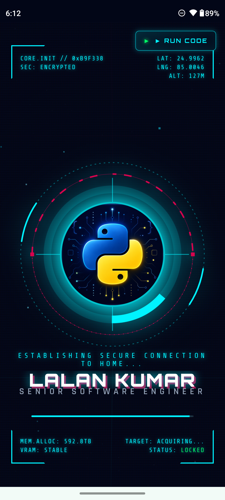
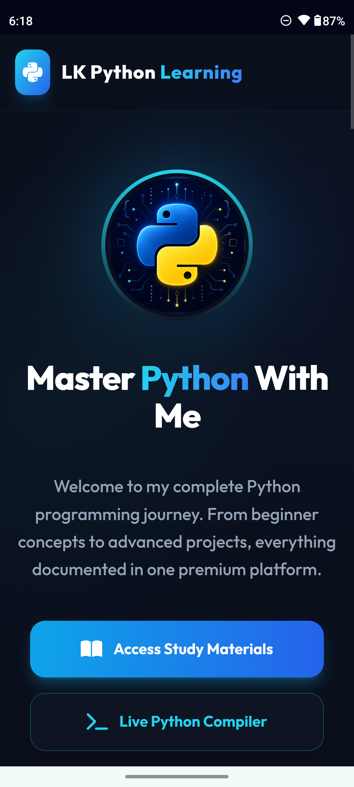
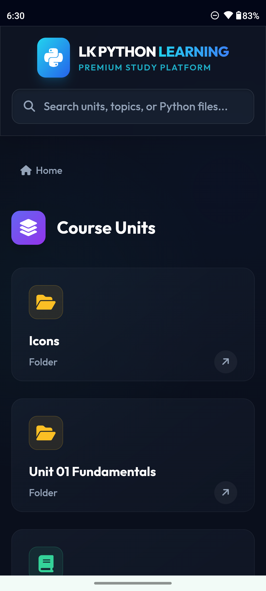
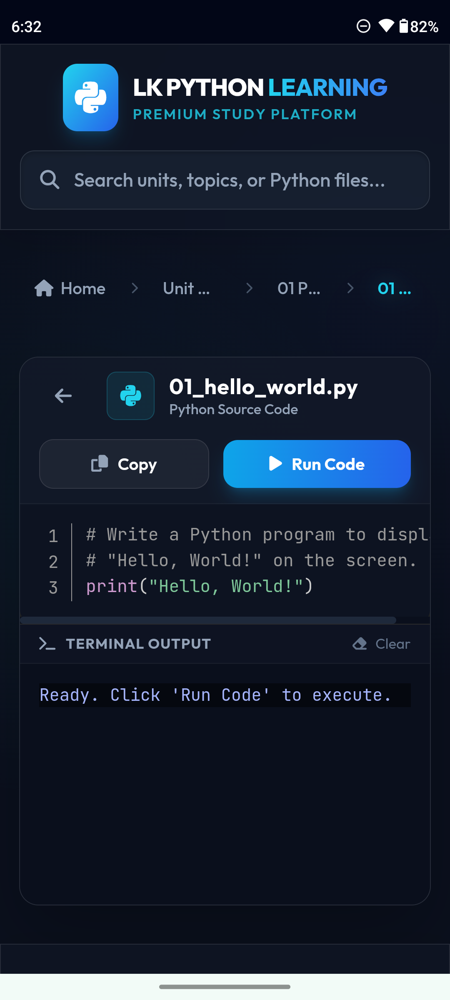
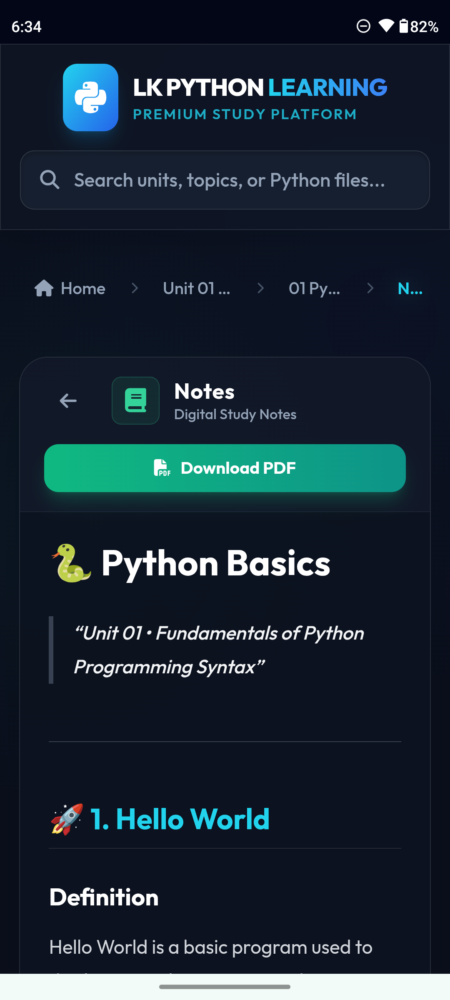
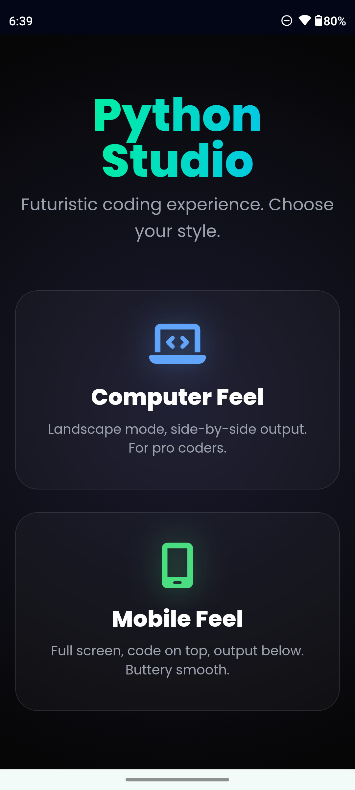
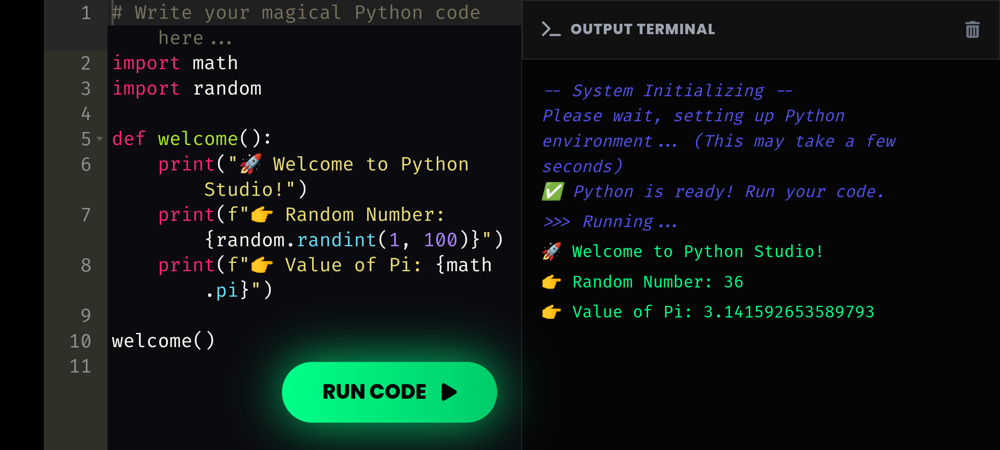
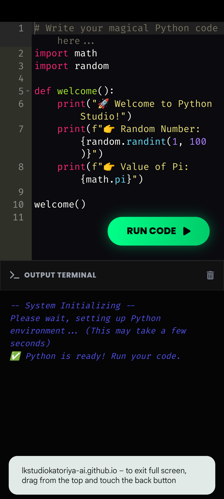

# 🐍 LK PYTHON LEARNING

# 🚀 LK Python Learning

**Learn Python • Practice Coding • Build Your Skills**

A modern, interactive and beginner-friendly Python learning
platform by **LALAN KUMAR**.

### 🌐 [VISIT WEBSITE](https://lkstudiokatoriya-ai.github.io/lk-python-learning/)

---

## 📱 Website Screenshots

**📸 Tap any screenshot to view it in full size.**

### 📱 Screenshot 2

---

### 📱 Screenshot 3

---

### 📱 Screenshot 4

---

### 📱 Screenshot 5

---

### 📱 Screenshot 6

---

### 🖥️ Screenshot 7 — Landscape View

---

### 📱 Screenshot 8

---

## 🌐 About The Website

**LK Python Learning** is a modern and interactive educational
website designed for students who want to learn Python
programming in a simple and practical way.

The platform provides an organized learning experience with
easy explanations, coding practice and useful programming
resources.

---

## 🎯 Our Goal

To make Python programming:

- 🐍 Simple
- 💡 Easy to Understand
- 💻 Practical
- 📚 Beginner Friendly
- 🚀 Interesting to Learn

---

## ✨ Key Features

| Feature | Description |
|---|---|
| 🐍 Python Learning | Step-by-step Python learning |
| 💻 Coding Practice | Practice programming concepts |
| 📚 Study Material | Organized learning resources |
| 📝 Practice | Improve coding skills |
| 🎯 Beginner Friendly | Easy explanations |
| 📱 Responsive | Mobile & desktop friendly |
| ⚡ Modern UI | Clean interface |
| 🌐 Web Based | Access directly from browser |

---

## 📚 Learning Flow

📖 **LEARN**

⬇️

💡 **UNDERSTAND**

⬇️

💻 **PRACTICE**

⬇️

🧠 **IMPROVE**

⬇️

🚀 **BUILD SKILLS**

---

## 🛠️ Technologies Used

- HTML5
- CSS3
- JavaScript
- GitHub Pages
- Markdown

---

## 🚀 Live Website

### 🌐 [OPEN LK PYTHON LEARNING](https://lkstudiokatoriya-ai.github.io/lk-python-learning/)

---

## 👨‍💻 Developer

### **LALAN KUMAR**

**LK STUDY STUDIO**

Python Programming & Educational Technology Project

---

## 📌 Project Information

| Information | Details |
|---|---|
| 🐍 Project | LK Python Learning |
| 📖 Category | Educational Platform |
| 💻 Subject | Python Programming |
| 🌐 Platform | Web |
| 🚀 Hosting | GitHub Pages |
| 👨‍💻 Developer | LALAN KUMAR |
| 🏷️ Brand | LK STUDY STUDIO |

---

## 🐍 Learn Python

### 💻 Practice Coding

### 🚀 Build Your Future

**Made with ❤️ by LALAN KUMAR**

---

⭐ **Keep Learning • Keep Coding • Keep Growing** ⭐
